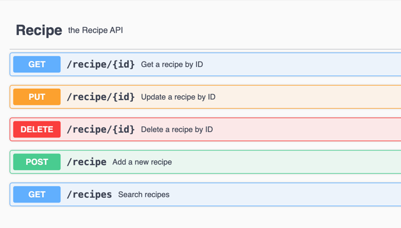

# Recipe Service Application

## Overview
The Recipe Service Application is a Spring Boot-based RESTful API that allows users to manage and search for recipes. It supports operations such as adding, updating, deleting, and searching for recipes based on various criteria.


## Features
* Add, update, retrieve, and delete recipes
* Search for recipes based on criteria such as vegetarian, servings, included ingredients, excluded ingredients, and instructions.
* H2 in-memory database for development and testing
* Swagger UI for API documentation

## Endpoints
The following endpoints are available in the Recipe Service Application.

#### Add Recipe
- **URL:** `/recipe`
- **Method:** `POST`
- **Description:** Add a new recipe.
- **Request Body:**
  ```json
  {
  "name": "Kadai paneer",
  "vegetarian": true,
  "servings": 2,
  "ingredients": [
    "onion", "tomato", "paneer", "bell peppers"
  ],
  "instructions": "Dry roast and crush coriander seeds, cumin, and red chilies for kadai masala; sauté onions, ginger-garlic paste, and tomato puree until oil separates.Add spices, bell peppers, paneer, kasuri methi, and salt; mix well"
  }
  ```
  - **Response Body:**
  ```json
  {
      "id": 1,
      "name": "Kadai paneer",
      "vegetarian": true,
      "servings": 2,
      "ingredients": [
          "onion",
          "tomato",
          "paneer",
          "capsicum"
      ],
      "instructions": "Dry roast and crush coriander seeds, cumin, and red chilies for kadai masala; sauté onions, ginger-garlic paste, and tomato puree until oil separates.Add spices, bell peppers, paneer, kasuri methi, and salt; mix well"
   }
  ```

#### Get Recipe by ID
- **URL:** `/recipe/{id}`
- **Method:** `GET`
- **Description:** Retrieves a recipe by ID.
- **Response Body:**
  ```json
  {
      "id": 1,
      "name": "Kadai paneer",
      "vegetarian": true,
      "servings": 2,
      "ingredients": [
          "onion",
          "tomato",
          "paneer",
          "capsicum"
      ],
      "instructions": "Dry roast and crush coriander seeds, cumin, and red chilies for kadai masala; sauté onions, ginger-garlic paste, and tomato puree until oil separates.Add spices, bell peppers, paneer, kasuri methi, and salt; mix well"
  }
  ```
#### Update Recipe
- **URL:** `/recipe/{id}`
- **Method:** `PUT`
- **Description:** Updates an existing recipe.
  - **Request Body:**
  ```json
  {
    "name": "Kadai paneer",
    "vegetarian": true,
    "servings": 4,
    "ingredients": [
      "onion", "tomato", "paneer", "bell peppers", "cumin", "red chilies"
    ],
    "instructions": "Dry roast and crush coriander seeds, cumin, and red chilies for kadai masala; sauté onions, ginger-garlic paste, and tomato puree until oil separates.Add spices, bell peppers, paneer, kasuri methi, and salt; mix well"
    }
    ```
    - **Response Body:**
    - ```json
      {
          "id": 1,
          "name": "Kadai paneer",
          "vegetarian": true,
          "servings": 4,
          "ingredients": [
              "onion",
              "tomato",
              "paneer",
              "bell peppers",
              "cumin",
              "red chilies"
          ],
          "instructions": "Dry roast and crush coriander seeds, cumin, and red chilies for kadai masala; sauté onions, ginger-garlic paste, and tomato puree until oil separates.Add spices, bell peppers, paneer, kasuri methi, and salt; mix well"
      }
      ```

#### Delete Recipe
- **URL:** `/recipe/{id}`
- **Method:** `DELETE`
- **Description:** Deletes a recipe by ID.
- **Response Body:**
  ```json
  {
      "message": "Recipe deleted successfully"
  }
  ```
#### Search Recipes
- **URL:** `/recipes`
- **Method:** `GET`
- **Description:** Search for recipes based on various criteria.
- **Request Parameters:**
  - `vegetarian`: Filter recipes by vegetarian (true/false)
  - `servings`: Filter recipes by servings
  - `includedIngredients`: Filter recipes by included ingredients.
  - `excludedIngredients`: Filter recipes by excluded ingredients.
  - `instructions`: Filter recipes by instructions.
  



## Technologies Used
* Java (Virtual Threads)
* Spring Boot
* Spring Security
* Spring Data JPA
* H2 Database
* Swagger UI
* Docker
* Maven
* Mockito
* JUnit5
* Rest Assured

## Prerequisites
* Java 21 or higher
* Maven 3.6.0 or higher
* Docker (for containerization)

## Getting Started

### Clone the Repository
```shell
git clone https://github.com/your-username/recipe-service.git
cd recipe-service
```
### Build the Project
```shell
mvn clean install
```
### Run the Application
```shell
mvn spring-boot:run
```
## Testing
1. Run `mvn test` to execute the unit tests.
2. Run `mvn verify` to execute the integration tests.

### Access H2 Console
- URL: `http://localhost:8100/h2-console`
- JDBC URL: `jdbc:h2:mem:testdb`
- Username: `sa`
- Password: `password`

### Spring Security Basic Authentication
Below credentials are used for basic authentication for all the endpoints of recipes-service:
- Username: `user`
- Password: `userpass`

### Access Swagger UI
- URL: `http://localhost:8100/swagger-ui/index.html`
### Usage
1. Use the Swagger UI to interact with the API.
2. Use the provided endpoints to manage recipes.

## Configuration
Configuration properties are defined in the `application.yml` files located in the `src/main/resources` directory.


### `schema.sql` for H2 Database
```sql
CREATE TABLE RECIPE
(
    id          INT PRIMARY KEY AUTO_INCREMENT,
    name        VARCHAR(255) NOT NULL,
    vegetarian  BOOLEAN,
    servings    INT,
    ingredients VARCHAR(255) NOT NULL,
    instructions VARCHAR(255) NOT NULL
);
```
### Completed Tasks
- Implemented the required REST endpoints:
- Used API first approach to design the REST endpoints. So the request validations are handled with swagger.
- Used H2 in-memory database to store recipe data.
- Used Docker and Docker Compose to containerize the application and its dependencies.
- Added Swagger documentation for the API endpoints.
- Swagger UI URL: `http://localhost:8100/swagger-ui/index.html`
- Ensured the application can be started with `docker-compose up`.

### Future Enhancements
- **Authentication and Authorization**: Implement security measures to protect the API endpoints.
- **Pagination**: Implement pagination for large datasets.
- **Rate Limiting**: Implement rate limiting to prevent abuse of the API.
- **Database Optimization**: Optimize database queries and indexing for better performance.
- **Monitoring**: Implement monitoring and alerting to track application health.


